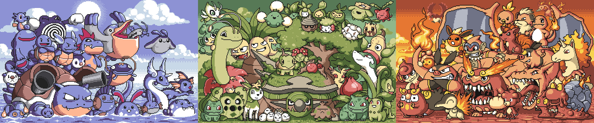

When I first saw the [pokebros](http://paulrobertson.mechafetus.com/allbros02.gif), I knew I had to stitch them. 

The artwork is by [Paul Robertson](https://twitter.com/probzz), an Australian artist known for his work with Australian band [Architecture in Helsinki](https://www.youtube.com/watch?v=MXIzyquw-kc), [Mercenary Kings](http://mercenarykings.com/), and [Scott Pilgrim vs The World: The Game](https://www.youtube.com/watch?v=yAY4vNJd7A8). 

*Bros, Paul Robertson, 2011*

These three works were created over the course of 2012. Each piece is 50cm x 80cm, with a wooden frame, the artwork mounted in recess. 

*Doug, Lynn, and Lorena; displaying the tapestries at the 2017 PyLadies Auction in Portland, Oregon. Photography by [Mike Pirnat](https://www.flickr.com/photos/mikepirnat/), all rights reserved*

These were donated to the [PyLadies Charity Auction](https://us.pycon.org/2017/events/auction/), and collectively raised more than USD$3100 for [pyladies](http://www.pyladies.com/), helping to improve the diversity of the software industry as a whole. 

The winners of these pieces were extremely happy. 

<blockquote class="twitter-tweet" data-theme="light">
We won this marvel at the <a href="https://twitter.com/pyladies?ref_src=twsrc%5Etfw">@pyladies</a> auction! Hand stitched by <a href="https://twitter.com/glasnt?ref_src=twsrc%5Etfw">@glasnt</a>. We are so happy! <a href="https://twitter.com/hashtag/PyCon2017?src=hash&amp;ref_src=twsrc%5Etfw">#PyCon2017</a> <a href="https://t.co/jaYavzHKYq">pic.twitter.com/jaYavzHKYq</a>
&mdash; Jair Trejo (@jairtrejo) <a href="https://twitter.com/jairtrejo/status/866164545303203842?ref_src=twsrc%5Etfw">May 21, 2017</a></blockquote> 

<blockquote class="twitter-tweet">
I went to the PyLadies auction and came away with this lovely piece (shown here with its wonderful creator, <a href="https://twitter.com/glasnt?ref_src=twsrc%5Etfw">@glasnt</a>)! <a href="https://t.co/7Z24ifgpgv">pic.twitter.com/7Z24ifgpgv</a>
&mdash; Andrew Godwin (@andrewgodwin) <a href="https://twitter.com/andrewgodwin/status/866178117689159681?ref_src=twsrc%5Etfw">May 21, 2017</a></blockquote> 

<blockquote class="twitter-tweet">
The green Pokémons followed me home from the <a href="https://twitter.com/pyladies?ref_src=twsrc%5Etfw">@pyladies</a> auction. Thank you <a href="https://twitter.com/glasnt?ref_src=twsrc%5Etfw">@glasnt</a>! <a href="https://twitter.com/hashtag/PyCon2017?src=hash&amp;ref_src=twsrc%5Etfw">#PyCon2017</a> <a href="https://t.co/I8XNq1r2At">pic.twitter.com/I8XNq1r2At</a>
&mdash; ⬛Gregory P😷🧼 Smith (he/him) (@gpshead) <a href="https://twitter.com/gpshead/status/866331088922091520?ref_src=twsrc%5Etfw">May 21, 2017</a></blockquote> 

You can donate to PyLadies [via the Python Software Foundation](https://psfmember.org/civicrm/contribute/transact?reset=1&id=6)
